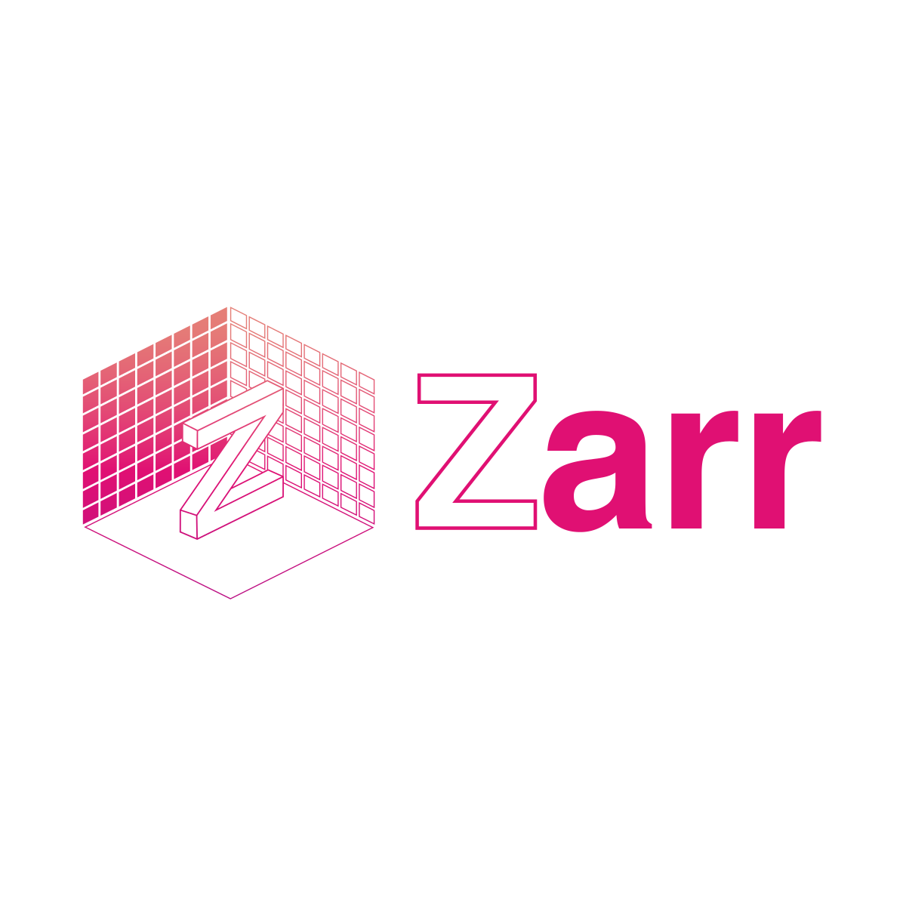
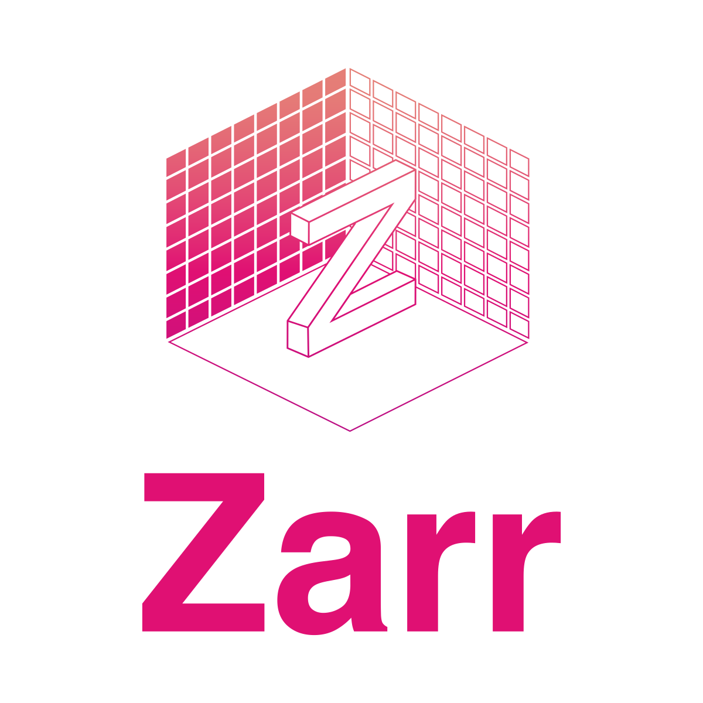
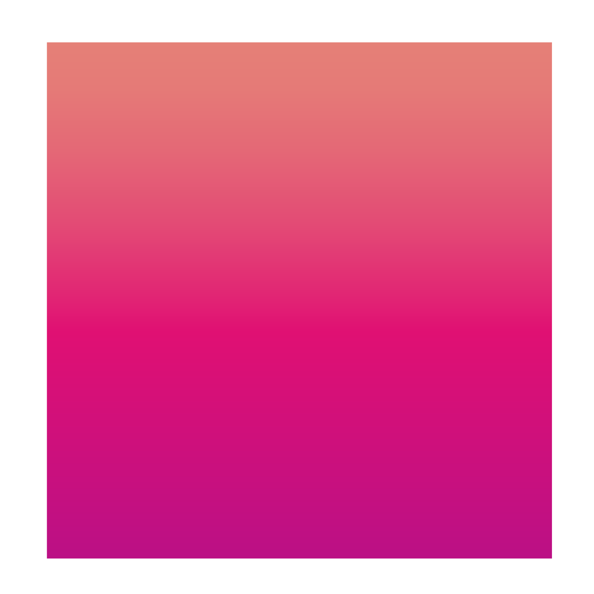

# Zarr Logo

## SVGs

### Horizontal

### Stacked

### Gradient
This is the color gradient that is used in the logo.

## Uses

Locations that are using these logos:
* zarr-python [settings](https://github.com/zarr-developers/zarr-python/settings) and [README](https://github.com/zarr-developers/zarr-python/blob/master/README.md)
* zarr-logo [settings](https://github.com/zarr-developers/zarr-logo/settings)
* all the GH org [teams](https://github.com/orgs/zarr-developers/teams)
* https://gitter.im/zarr-developers/community avatar
* https://twitter.com/zarr_dev profile
